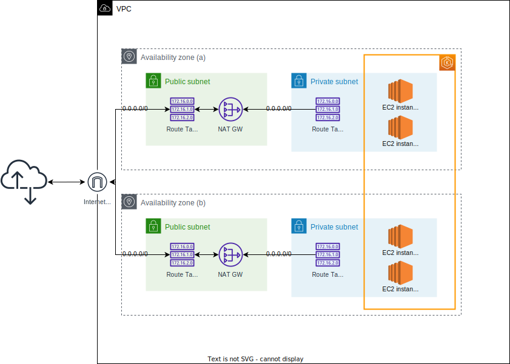
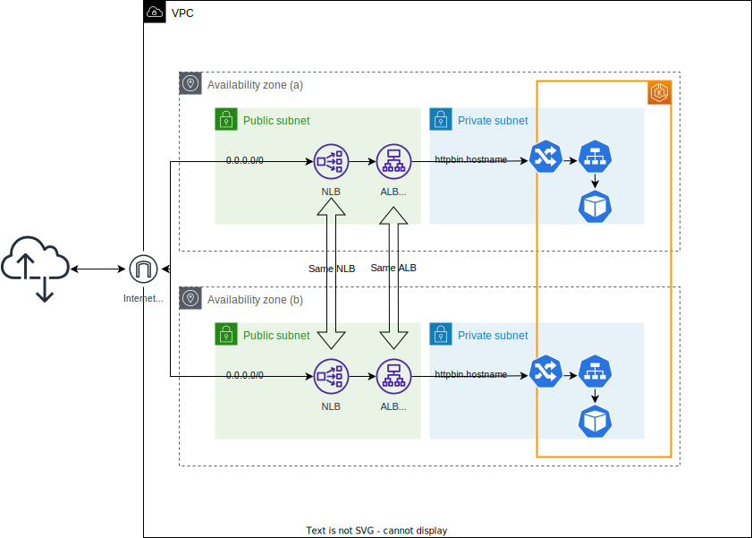

<!--
SPDX-FileCopyrightText: 2025 Deutsche Telekom AG

SPDX-License-Identifier: CC0-1.0    
-->

# Installation on AWS EKS

This guide provides instructions for setting up a Kubernetes cluster on AWS EKS and deploying the Open Telekom
Integration Platform.  
Please note that the following instructions rely on defaults and may need to be adjusted to your specific requirements.
Especially once you consider a production setup.

## VPC Setup

1. Create a VPC with at least two subnets in different availability zones.
2. Create a NAT gateway in each subnet.
3. Associate the route tables of the subnets with the NAT gateways.



## EKS Cluster Setup

Follow the [Getting started with AWS EKS - EKS Auto Mode guide](https://docs.aws.amazon.com/eks/latest/userguide/automode-get-started-console.html)

1. We chose to use the AWS Management Console to create the EKS cluster.
2. We chose to use the Quick configuration with EKS Auto Mode.
3. We chose `o28m` as the cluster name.
4. We chose Kubernetes version 1.31.
5. We chose to create a recommended Cluster IAM role.
6. We chose to create a recommended Node IAM role.
7. We associated the VPC we created earlier with the EKS cluster.
8. We placed the EKS cluster in the private subnets.
9. Wait for the EKS cluster to be created.
10. The setup will create a `system` node group with two nodes and a scaled-down `general-purpose` node group.
11. We chose to use the default settings for the node groups.

## Cluster Configuration

### Access

#### CloudShell

Connect to the cluster by following this [guide](https://docs.aws.amazon.com/eks/latest/userguide/create-kubeconfig.html#create-kubeconfig-automatically).

#### Local Shell
1. Create an IAM user with the necessary permission policy. This is an example policy for simplicity. Adjust this according to your **productive** requirements:
   ```json
   {
     "Version": "2012-10-17",
     "Statement": [
      {
        "Effect": "Allow",
        "Action": "eks:*",
        "Resource": "*"
      }
     ]
   }
   ```
2. Generate an access key and secret key for the user.
3. Add this user to the EKS IAM access entry in the AWS Management Console. We chose to use the type `Standard`.
4. Add an access policy to the EKS IAM access entry. For simplicity, we chose to use the `AmazonEKSClusterAdminPolicy` policy. Adjust this according to your **productive** requirements.
5. Install the AWS CLI and configure it with the access key and secret key.
6. Follow this [guide](https://docs.aws.amazon.com/eks/latest/userguide/create-kubeconfig.html#create-kubeconfig-automatically) to configure `kubectl` to access the EKS cluster.

### Add-ons

The following add-ons are required (all are already included out of the box if [using EKS Auto Mode](https://docs.aws.amazon.com/eks/latest/userguide/eks-add-ons.html#addon-consider-auto)):

- kube-proxy
- CoreDNS
- Amazon EBS CSI Driver
- Amazon VPC CNI

### Storage Class

Follow the [AWS EKS Auto Mode Create Storage Class guide](https://docs.aws.amazon.com/eks/latest/userguide/create-storage-class.html).

1. We chose to use the following storage class:
    ```yaml
    apiVersion: storage.k8s.io/v1
    kind: StorageClass
    metadata:
      name: auto-ebs-sc
      annotations:
        storageclass.kubernetes.io/is-default-class: "true"
    provisioner: ebs.csi.eks.amazonaws.com
    volumeBindingMode: WaitForFirstConsumer
    parameters:
      type: gp3
      encrypted: "true"
    ```

### Ingress Class

Follow the [AWS EKS Auto Mode Create Ingress Class guide](https://docs.aws.amazon.com/eks/latest/userguide/auto-configure-alb.html).


1. Request a certificate from ACM for the domain you want to use. We chose a wildcard certificate.

2. We chose the following `IngressClassParams`:
   ```yaml
   apiVersion: eks.amazonaws.com/v1
   kind: IngressClassParams
   metadata:
     name: alb-public
   spec:
     scheme: internet-facing
     sslPolicy: ELBSecurityPolicy-TLS13-1-2-Res-2021-06
     group:
       name: alb-public
   ```

3. We chose the following `IngressClass`:
   ```yaml
   apiVersion: networking.k8s.io/v1
   kind: IngressClass
   metadata:
    name: alb-public
    annotations:
    # Use this annotation to set an IngressClass as Default
    # If an Ingress doesn't specify a class, it will use the Default
      ingressclass.kubernetes.io/is-default-class: "true"
   spec:
   # Configures the IngressClass to use EKS Auto Mode
    controller: eks.amazonaws.com/alb
    parameters:
      apiGroup: eks.amazonaws.com
      kind: IngressClassParams
      # Use the name of the IngressClassParams set in the previous step
      name: alb-public
      scope: Cluster
   ```

4. We tagged all **public** subnets with the following tags:
   - `kubernetes.io/cluster/o28m` with the value `shared`
   - `kubernetes.io/role/elb` with the value `1`

5. We created a Network Load Balancer (NLB) with the following settings:
   - Scheme: internet-facing
   - VPC: the VPC we created earlier
   - Subnets: the **public** subnets
   - Security groups: a new one allowing for external traffic on port 443

6. We created a Security Group for the ingress ALBs with the following settings:
   - Inbound rules:
     - Type: HTTPS
     - Source: the previously created NLB's security group
     - Port: 443

7. We modified the EKS cluster's role by attaching an additional policy `ElasticLoadBalancingFullAccess`
   to allow the cluster to manage the ALBs including their rules. In a productive setup consider a more restrictive policy.

8. We modified the EKS cluster's role by attaching an additional policy as described in the
   [AWS EKS Auto Mode IAM guide](https://docs.aws.amazon.com/eks/latest/userguide/auto-learn-iam.html#tag-prop) 
   to enable the creation of custom node pools.

#### Verify the setup

1. To test the setup we created an `httpbin`-based deployment and example `Ingress` resource:
   ```yaml
   apiVersion: apps/v1
   kind: Deployment
   metadata:
      name: httpbin-deployment
      labels:
         app: httpbin
   spec:
      replicas: 1
      selector:
         matchLabels:
            app: httpbin
      template:
         metadata:
            labels:
               app: httpbin
         spec:
            containers:
               - name: httpbin
                 image: mccutchen/go-httpbin
                 ports:
                    - containerPort: 8080
                 resources:
                    limits:
                       cpu: 100m
                       memory: 128Mi
                    requests:
                       cpu: 100m
                       memory: 128Mi
                 securityContext:
                    readOnlyRootFilesystem: true
                    runAsNonRoot: true
                    runAsUser: 1000
   
   ---
   
   apiVersion: v1
   kind: Service
   metadata:
      name: httpbin-service
      labels:
         app: httpbin
   spec:
      selector:
         app: httpbin
      ports:
         - protocol: TCP
           port: 8080
           targetPort: 8080
      type: ClusterIP
   
   ---
   
   apiVersion: networking.k8s.io/v1
   kind: Ingress
   metadata:
     name: test-ingress
     annotations:
       alb.ingress.kubernetes.io/listen-ports: '[{"HTTPS":443}]'
       alb.ingress.kubernetes.io/security-groups: sg-{ALBSecurityGroup}, sg-{ClusterSecurityGroup}
       alb.ingress.kubernetes.io/tags: yourtag=yourvalue,another=tag
   spec:
     ingressClassName: alb-public
     rules:
     - host: httpbin.your-hostname
       http:
         paths:
         - path: /
           pathType: Prefix
           backend:
             service:
               name: httpbin-service
               port:
                 number: 8080
     ```
2. Your setup should look like this:
    

3. Register the Ingress DNS name (or just a wildcard entry) in the DNS settings of your domain with a CNAME record pointing to the NLB DNS name.

4. Register the ALB within the target group of the NLB. If it does not yet exist, create a new target group for the NLB for port 443 and add the ALB to it.  
   We chose to name the target group `alb-public-ssl` and set the health check protocol to HTTPS and the success codes to `200-404`.

5. Verify the setup by accessing the `httpbin` service using the Ingress DNS name:
   ```bash
   curl -v https://httpbin.<your-hostname>/get
   ```

## Database Setup

While the Open Telekom Integration Platform supports various database deployments, we chose to use AWS RDS Aurora PostgreSQL.

1. Navigate to the AWS Management Console and create an Aurora PostgreSQL database.
2. We chose to use the `Easy create` option and the following values:
   * Engine type: Aurora (PostgreSQL Compatible)
   * DB instance size: Dev/Test (Serverless v2)
   * DB cluster identifier: o28m
   * Keep the rest of the settings at their default values.
3. Wait for the database to be created.
4. Create a new security group for the database cluster allowing traffic from the EKS cluster:
   - Inbound rules:
     - Type: PostgreSQL
     - Source: the EKS cluster's security group
     - Port: 5432
5. Modify the DB instance's settings and add the EKS cluster's security group in the `Connectivity` section allowing traffic from the EKS cluster.
6. For the sake of simplicity, enable the RDS Data API for the database cluster.
7. Access the Query Editor (using the secret manager arn and the default database `postgres`) and create the necessary databases and users:
    ```sql
    CREATE DATABASE iris;
    CREATE USER iris WITH PASSWORD '<change-me>';
    GRANT ALL PRIVILEGES ON DATABASE iris TO iris;
   
    CREATE DATABASE gateway;
    CREATE USER gateway WITH PASSWORD '<change-me>';
    GRANT ALL PRIVILEGES ON DATABASE gateway TO gateway;
    ```
8. Change the current database in the Query editor to `iris` and execute:
    ```sql
    GRANT ALL ON SCHEMA public TO iris;
    ```
9. Change the current database in the Query editor to `gateway` and execute:
    ```sql
    GRANT ALL ON SCHEMA public TO gateway;
    ```

## Open Telekom Integration Platform Installation

Install the Open Telekom Integration Platform using the following steps.

### Building the images

Examples containing build scripts for building all necessary images can be found under [https://github.com/telekom/Open-Telekom-Integration-Platform/blob/main/build/README.md](https://github.com/telekom/Open-Telekom-Integration-Platform/blob/main/build/README.md).  
Please fork it and adjust it to your needs.

**We are not providing a public image repository for the Open Telekom Integration Platform.**

1. Build Identity-Iris:
   * identity-iris-keycloak: [`https://github.com/telekom/identity-iris-keycloak-image`](https://github.com/telekom/identity-iris-keycloak-image) with `./Dockerfile.multi-stage`

2. Build the Gateway:
   * gateway-jumper: [`https://github.com/telekom/gateway-jumper`](https://github.com/telekom/gateway-jumper) with `./Dockerfile.multi-stage`
   * gateway-issuer-service-go: [`https://github.com/telekom/gateway-issuer-service-go`](https://github.com/telekom/gateway-issuer-service-go) with `./Dockerfile.multi-stage`
   * gateway-bash-curl: A helper image to bootstrap and configure the Gateway.  
     This image can be built using the following Dockerfile:
     ```Dockerfile
     FROM quay.io/curl/curl-base:latest

     RUN apk add --no-cache bash
      
     ENTRYPOINT ["/bin/bash", "-c", "while true; do sleep 86400; done"]
     ```
   * gateway-kong: [`https://github.com/telekom/gateway-kong-image`](https://github.com/telekom/gateway-kong-image) with `./Dockerfile`

3. Push the images to a registry of your choosing.

4. Make sure to make the images available to your Kubernetes cluster.

### Deploy the components

#### Identity-Iris

1. Clone the repository:
   ```bash
   git clone https://github.com/telekom/identity-iris-keycloak-charts.git
   ```

2. Create a `identity-iris.values.local.yaml` file with the following content:
    ```yaml
   # Database config
   global:
     database:
       location: external # set to 'external' to NOT deploy a local database workload
       username: iris # as set in the RDS database
       database: iris # as set in the RDS database
       password: <change-me> # as set in the RDS database
   
   externalDatabase:
     host: {RDS_Write_Endpoint}.{Region}.rds.amazonaws.com # as provided by the RDS database
     ssl: false
   
   postgresql:
     image: <registry>/o28m/postgresql

   # Ingress config
   ingress:
     enabled: true
     hostname: iris.<your-hostname>
     ingressClassName: alb-public # as set in the IngressClass
     annotations:
       alb.ingress.kubernetes.io/listen-ports: '[{"HTTPS":443}]'
       alb.ingress.kubernetes.io/security-groups: sg-{ALBSecurityGroup}, sg-{ClusterSecurityGroup}
       alb.ingress.kubernetes.io/tags: example=tag,another=one
   
   # Keycloak config
   keycloak:
     image: <registry>/o28m/identity-iris-keycloak # as pushed to your registry 

   haproxy:
     image: <registry>/o28m/haproxy

   adminUsername: admin 
   adminPassword: <change-me> # set a secure password
   
   # Resources and Scale
   resources:
     limits:
       cpu: 500m
       memory: 1Gi
     requests:
       cpu: 100m
       memory: 600Mi
   
   replicas: 2
    ```

3. Deploy the Helm chart:
    ```bash
    namespace=o28m
    helm upgrade -i -n $namespace --create-namespace -f identity-iris.values.local.yaml iris identity-iris-keycloak-charts/
    ```

4. Navigate to `Iris` using the Ingress DNS name and the provided credentials: `https://iris.<your-hostname>/auth/admin/master/console/`

5. Create new realm: `default` ( skip this if you are using central control plane for onboarding ).

6. Configure the `default` realm ( skip this if you are using central control plane for onboarding ):
   * Use the following scopes and mappers (`https://iris.<your-hostname>/auth/admin/master/console/#/default/client-scopes`):
   * Create a new client-scope named `open-telekom-integration-platform` with the type `optional`. 
   * Create a second new client-scope named `client-origin` with the type `default`.
   * Add a new mapper by configuration to the `client-origin` client-scope with the following settings:
       - Mapper Type: `Hardcoded claim`
       - Name: `originZone`
       - Token Claim Name: `originZone`
       - Claim value: `<zone>`
       - Claim JSON Type: `String`
       - Add to ID token: `On`
       - Add to access token: `On`
       - Add to userinfo: `On`
       - Add to access token response: `Off`

   * Add a second new mapper by configuration to the `client-origin` client-scope with the following settings:
       - Mapper Type: `Hardcoded claim`
       - Name: `originStargate`
       - Token Claim Name: `originStargate`
       - Claim value: `https://gateway.<your-hostname>`
       - Claim JSON Type: `String`
       - Add to ID token: `On`
       - Add to access token: `On`
       - Add to userinfo: `On`
       - Add to access token response: `Off`

7. Create new realm: `rover`.

8. Create a new client with the client ID `rover` in the realm `rover`:
    <details>

   <summary>Client Configuration</summary>

    ```json
    {
      "clientId": "rover",
      "name": "rover",
      "surrogateAuthRequired": false,
      "enabled": true,
      "alwaysDisplayInConsole": false,
      "clientAuthenticatorType": "client-secret",
      "secret": "<changeme>",
      "redirectUris": [],
      "webOrigins": [],
      "notBefore": 0,
      "bearerOnly": false,
      "consentRequired": false,
      "standardFlowEnabled": false,
      "implicitFlowEnabled": false,
      "directAccessGrantsEnabled": false,
      "serviceAccountsEnabled": true,
      "publicClient": false,
      "frontchannelLogout": false,
      "protocol": "openid-connect",
      "attributes": {},
      "authenticationFlowBindingOverrides": {},
      "fullScopeAllowed": false,
      "nodeReRegistrationTimeout": -1,
      "protocolMappers":
      [
        {
          "name": "Client Host",
          "protocol": "openid-connect",
          "protocolMapper": "oidc-usersessionmodel-note-mapper",
          "consentRequired": false,
          "config": {
            "user.session.note": "clientHost",
            "id.token.claim": "true",
            "access.token.claim": "true",
            "claim.name": "clientHost",
            "jsonType.label": "String"
          }
        },
        {
          "name": "Client IP Address",
          "protocol": "openid-connect",
          "protocolMapper": "oidc-usersessionmodel-note-mapper",
          "consentRequired": false,
          "config": {
            "user.session.note": "clientAddress",
            "id.token.claim": "true",
            "access.token.claim": "true",
            "claim.name": "clientAddress",
            "jsonType.label": "String"
          }
        },
        {
          "name": "Client ID",
          "protocol": "openid-connect",
          "protocolMapper": "oidc-usersessionmodel-note-mapper",
          "consentRequired": false,
          "config": {
            "user.session.note": "clientId",
            "id.token.claim": "true",
            "access.token.claim": "true",
            "claim.name": "clientId",
            "jsonType.label": "String"
          }
        }
      ],
      "defaultClientScopes": [
        "web-origins",
        "client-origin",
        "profile",
        "roles",
        "email"
      ],
      "optionalClientScopes": [
        "address",
        "phone",
        "open-telekom-integration-platform",
        "offline_access",
        "microprofile-jwt"
      ],
      "access": {
        "view": true,
        "configure": true,
        "manage": true
      }
    }
    ```
   </details>

10. Validate the setup by requesting an access token for the `rover` client:
    ```bash
    curl -X POST https://iris.<your-hostname>/auth/realms/rover/protocol/openid-connect/token \
    -H 'Content-Type: application/x-www-form-urlencoded' \
    -d 'client_id=rover' \
    -d 'client_secret=<changeme>' \
    -d 'grant_type=client_credentials'
    ```

#### Gateway

**Attention**  
Before working with the helm chart, you need to create some secret values beforehand in order for the gateway to work properly.

##### Admin API Key
The gateway chart requires a .htpasswd file for an initial basic authentication. You may use the
following command to create the content of file which later will be stored in a Kubernetes secret. Replace `adminApiKey`
with your desired password. The output of the command will be used in the `values.local.yaml` file.

```shell
htpasswd -b -n admin adminApiKey
```

##### Issuer Service Key Pair
Further, the gateway requires a specific secret format which is described in the [gateway-rotator](https://github.com/telekom/gateway-rotator?tab=readme-ov-file#why). On the one hand you´re able to autogenerate a valid secret if a working gateway-rotator operator as well as cert-manager are available in your cluster. The corresponding changes for your helm values are documented in the [gateway-kong-charts](https://github.com/telekom/gateway-kong-charts?tab=readme-ov-file#from-6xx-to-version-7xx--warning-breaking-change-warning-) or see [values.yaml](https://github.com/telekom/gateway-kong-charts/blob/main/values.yaml) for the block `keyRotation.enabled`.

For simplicity, we manually create the secret for now to generate the necessary secret manually with the following shell commands:

```shell
# create cert and key pair
openssl req -x509 -nodes -days 365 -newkey rsa:2048 -keyout tls.key -out tls.crt -subj "/CN=gateway.<your-hostname>"
# create base64 encoded sha1sum for usage as kid
TLS_KEY_KID=$(sha1sum tls.crt | awk '{printf "%s", $1}' | base64)
kubectl create secret tls gateway-tls-rotated --cert=tls.crt --key=tls.key --dry-run=client -o go-template='
apiVersion: v1
kind: Secret
metadata:
  namespace: o28m
  name: {{ .metadata.name }}
type: kubernetes.io/tls
data:
  tls.key: {{ index .data "tls.key" }}
  tls.kid: changeme
  tls.crt: {{ index .data "tls.crt" }}
  prev-tls.key: {{ index .data "tls.key" }}
  prev-tls.kid: changeme
  prev-tls.crt: {{ index .data "tls.crt" }}
  next-tls.key: {{ index .data "tls.key" }}
  next-tls.kid: changeme
  next-tls.crt: {{ index .data "tls.crt" }}
' | sed "s/changeme/${TLS_KEY_KID}/g" | kubectl apply -f -
```

- Issuer-Service-Go makes use of all certs and kids to provide all needed openid well-known endpoints which are needed from a gateway provider side to validate oauth access tokens reaching them
- Gateway jumper always uses `tls.key` as well as `tls.kid` to issue access tokens. This gives you the option to gracefully renew / rotate keys within gateway oauth issueing system

##### Configure and Deploy the Gateway

1. Create a `gateway.values.local.yaml` file with the following content:
    ```yaml
    
    global:
      zone: <zone>  # The zone in which the application is deployed. This is determined by the central configuration management.
    
      # General ingress settings
      ingress:
        ingressClassName: alb-public  # as set in the IngressClass
        annotations:
          alb.ingress.kubernetes.io/listen-ports: '[{"HTTPS":443}]'
          alb.ingress.kubernetes.io/security-groups: sg-{ALBSecurityGroup}, sg-{ClusterSecurityGroup}
          alb.ingress.kubernetes.io/tags: example=tag,another=one
    
      # Database config
      database:
        location: external # set to 'external' to NOT deploy a local database workload
        username: gateway # as set in the RDS database
        database: gateway # as set in the RDS database
        password: <change-me> # as set in the RDS database
    
    externalDatabase:
      host: {RDS_Write_Endpoint}.{Region}.rds.amazonaws.com # as provided by the RDS database
      ssl: false
    
    postgresql:
      image: <registry>/o28m/postgresql
    
    migrations: bootstrap # Initial setup of the database and Kong. Change to "upgrade" ONLY for version upgrades.
    
    # Gateway config
    
    image: <registry>/o28m/gateway-kong-postgresql-fix:latest # The kong image
    
    jumper:
      image: <registry>/o28m/gateway-jumper
      existingJwkSecretName: gateway-tls-rotated
      stargateUrl: https://gateway.<your-hostname> # The gateway URL
      issuerUrl: https://gateway.<your-hostname>/auth/realms # This URL points to the gateway-issuer-service, which is the issuer of the LMS / gateway tokens.
    
    job:
      image: <registry>/o28m/bash-curl # Helper image for the bootstrap and config jobs
    
    proxy:
      ingress:
        hosts:
          - host: gateway.<your-hostname> # the api gateway hostname
            paths:
              - path: /
                pathType: Prefix
    
    adminApi:
      ingress:
        hosts:
          - host: gateway-admin.<your-hostname> # the admin api hostname
            paths:
              - path: /
                pathType: Prefix
      gatewayAdminApiKey: adminApiKey # Use the password specified during the htpasswd command above.
      htpasswd: "admin:$apr1$iXCoWLYQ$oCrteDqJuXOu.SjUfC9MI0" # Use the output of the htpasswd command above.
    
    # Issuer Service config
    issuerService:
      image: <registry>/o28m/gateway-issuer-service
      existingJwkSecretName: gateway-tls-rotated
    
    # Kong Plugin setup
    plugins:
      enabled: []
      jwtKeycloak:
        enabled: true # Enable the JWT Keycloak plugin.
        allowedIss:
          - "https://iris.<your-hostname>/auth/realms/rover" # The previously configured issuer URL of the identity provider's rover realm.
      requestSizeLimiting:
        enabled: true # Enable request size limiting. This limits the request size to 4MB by default.
      prometheus:
        enabled: false # No Prometheus setup for now.
      zipkin:
        enabled: false # No Zipkin setup for now.
    
    # Resources and Scale
    replicas: 2
    ```

2. Deploy the Helm chart:
    ```bash
    namespace=o28m
    helm upgrade -i -n $namespace --create-namespace -f gateway.values.local.yaml gateway gateway-kong-charts/
    ```
   
3. Validate the setup by accessing the Gateway using the Proxy Ingress DNS name and the rover client:
    ```bash
   TOKEN=$(curl -X POST https://iris.<your-hostname>/auth/realms/rover/protocol/openid-connect/token \
    -H 'Content-Type: application/x-www-form-urlencoded' \
    -d 'client_id=rover' \
    -d 'client_secret=<changeme>' \
    -d 'grant_type=client_credentials' | jq -r '.access_token'
   )
    curl -v -H "Authorization: Bearer ${TOKEN}" https://gateway-admin.<your-hostname>/admin-api/consumers
    ```

#### Event-Driven Integration / Pubsub

tbd.

### Connect

You have multiple options to establish the necessary connectivity for the freshly created instance.

#### Inbound connectivity / Configuration Management & Inbound Mesh

1. Via Internet:
   * You're good to go, if the configuration management can route and access the Ingress DNS names of the components.
2. Via VPC Endpoint Services:
   * Create a VPC Endpoint Service in the VPC where the EKS is deployed:
     * We chose `NLB` as the endpoint service type.
     * We associated the existing NLB with the endpoint service.
     * Create the endpoint service.
     * Add the ARN of the remote AWS account to the endpoint service as an allowed principal.
   * Share the endpoint service id with the remote AWS account.
   * Create a VPC endpoint in the remote AWS account:
     * We chose the `Endpoint services that use NLBs and GWLBs` type.
     * We added the endpoint service id.
     * We added the security group of the configuration management's EKS cluster.
   * Add a new private hosted zone in the remote AWS account's Route 53:
     * The hosted zone should have the same name as the Ingress DNS names of the components.
     * We chose the VPC of the remote AWS account as the VPC association.
     * We added the following entry `*.<your-hostname>` with the NLB DNS name as the ALIAS value.
   * The configuration management can now access the components using the Ingress DNS names.

#### Outbound connectivity / Gateway Mesh

1. Via Internet:
   * You're good to go, if the components can route and access the remote gateway's Ingress DNS names of the configuration management.
2. Via VPC Endpoint Services:
   * Create a VPC Endpoint Service in the VPC where the remote gateway is deployed:
     * We chose `NLB` as the endpoint service type.
     * We associated an NLB with the endpoint service.
     * Create the endpoint service.
     * Add the ARN of your local AWS account to the endpoint service as an allowed principal.
   * Share the endpoint service id with your local AWS account.
   * Create a VPC endpoint in your local AWS account:
     * We chose the `Endpoint services that use NLBs and GWLBs` type.
     * We added the endpoint service id.
     * We added the security group of the local EKS cluster.
   * Add a new private hosted zone in your local AWS account's Route 53:
     * The hosted zone should have the same name as the Ingress DNS names of the remote gateway.
     * We chose the VPC of the local AWS account as the VPC association.
     * We added the following entry `*.<remote-gw-hostname>` with the endpoint service's DNS name as the ALIAS value.
   * The components can now access the remote gateway using the configured DNS names of teh private hosted zones.


### Full Setup

The full setup should look like this:

